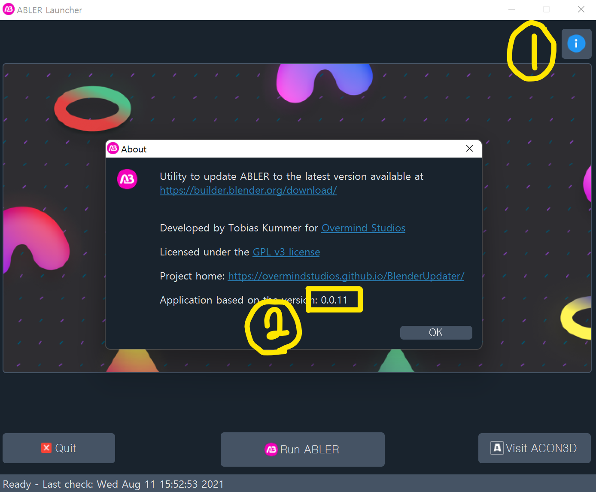

# 런처 환경 세팅

## 의존성 파일 설치

```commandline
$ pip install -r requirements.txt
```


## 이미지 데이터 `.py` 파일 생성

`res.qrc` 파일로부터 이미지 데이터가 포함된 `.py` 파일을 생성해야합니다.
해당 항목은 `PyQt5`가 설치된 상태에서 수행 가능합니다.

```commandline
$ pyrcc5 res.qrc -o res_rc.py
```

위 명령을 수행하면 `res_rc.py` 파일이 생성된 것을 확인할 수 있습니다.


## Config 파일 업데이트

### 요구 사항

- 아래 4개의 Case별로 업데이트 실행 후 `Run ABLER`가 잘 동작하는지 확인 필요
- `C:\Users\{username}\AppData\Roaming\Blender Foundation\Blender\2.96\updater` 경로에 `config.ini` 파일의 ABLER 및 Launcher 버전을 수정하면서 업데이트 실행

|        | Launcher | ABLER |
|--------|----------|-------|
| Case 1 | X        | X     |
| Case 2 | X        | O     |
| Case 3 | O        | X     |
| Case 4 | O        | O     |

### Windows

1. **관리자 권한**으로 터미널 실행
    - `AblerLauncher.exe` 가 숨김 폴더에 있기 때문에, 런처 업데이트 후 재실행을 위해서 관리자 권한이 필요


2. 터미널에서 ABLER Launcher 디렉터리로 이동
    
    ```bash
    $ cd ~/blender/launcher_abler
    ```


3. `config.ini` 파일 백업
    
    ```bash
    $ python ConfigUpdater.py --copy
    ```


4. 하나의 명령어를 실행하고, 다음 과정으로 이동
    - 런처가 에이블러보다 상대적으로 업데이트를 적게 하기 때문에 에이블러 업데이트를 먼저하길 권장합니다.
    
    ```bash
    # Case 1 : Launcher X / ABLER X
    $ python ConfigUpdater.py --run
    
    # Case 2 : Launcher X / ABLER O
    $ python ConfigUpdater.py --run --update abler
    
    # Case 3 : Launcher O / ABLER X
    $ python ConfigUpdater.py --run --update launcher
    
    # Case 4 : Launcher O / ABLER O
    $ python ConfigUpdater.py --run --update launcher abler
    ```


5. 필요한 업데이트를 완료


6. `Launcher` 버전 확인
   
   


7. `ABLER` 버전 확인
   
   


8. `config.ini` 파일 리셋 및 백업 파일 삭제
    
    ```bash
    $ python ConfigUpdater.py --reset --remove
    ```
